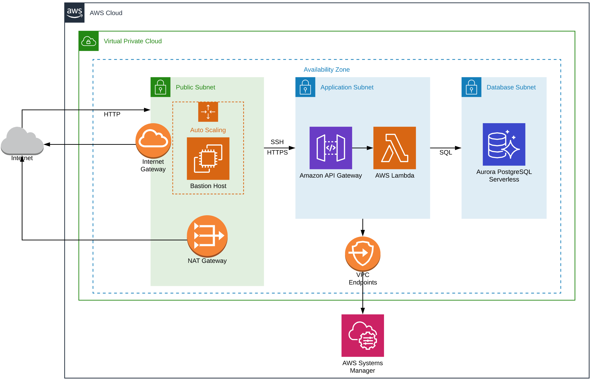

# terraform-serverless

This provides Terraform and Serverless configurations to deploy a basic serverless AWS architecture.
The goal is to provide a low cost yet secure and scalable infrastructure that would support serverless
applications. The only "application" included is a Lambda API that returns a list of tables from a 
PostgreSQL database as a JSON response.

## Overview

Here is a sample network diagram for a single availability zone. The default variables will deploy to three AZs (us-east-1a, us-east-1b, us-east-1c) but for simplicity only one is shown. All three would look the same though.



## Features

* Serverless - the Lambda functions and Aurora database are all serverless so they will scale up and down as needed.

* Secure - public, application and database resources are all separated into their own subnets and security groups. Only the required routes and ports are allowed between subnets.

* Highly Available - all services are distributed across multiple availability zones.

## Assumptions

You have the following installed and configured:
* [terraform](https://www.terraform.io/)
* [serverless](https://serverless.com/)
* [npm](https://www.npmjs.com/)
* [node.js](https://nodejs.org/en/)

## Usage

Deploy the Terraform project first as that establishes all of the low level networking and database that are required by Serverless. This step will have to be repeated whenever resources are changed in the "deploy" folder.

```
cd deploy
terraform apply
```

Deploy the Serverless project to create the API Gateway and Lambda function. This step will have to repeated whenever handler code is changed.

```
cd ../source
serverless deploy
```

To remove the deployment from your AWS account do the following.

```
cd source
serverless remove
cd ../deploy
terraform destory
```

## TODO

Since this just provides a starting point for a serverless application there are a lot of potential improvements or follow up steps that would be needed before it is ready for production usage. Some of these tasks may include:

* Creatign a frontend UX
* Adding end user authentication/authorization
* Rotating database passwords
* Improved logging and analytics
* Custom domain and SSL certificate

## Authors

* **Ted O'Connor** - [opub](https://github.com/opub)

## License

This project is licensed under the Apache License 2.0 - see the [LICENSE](LICENSE) file for details.
